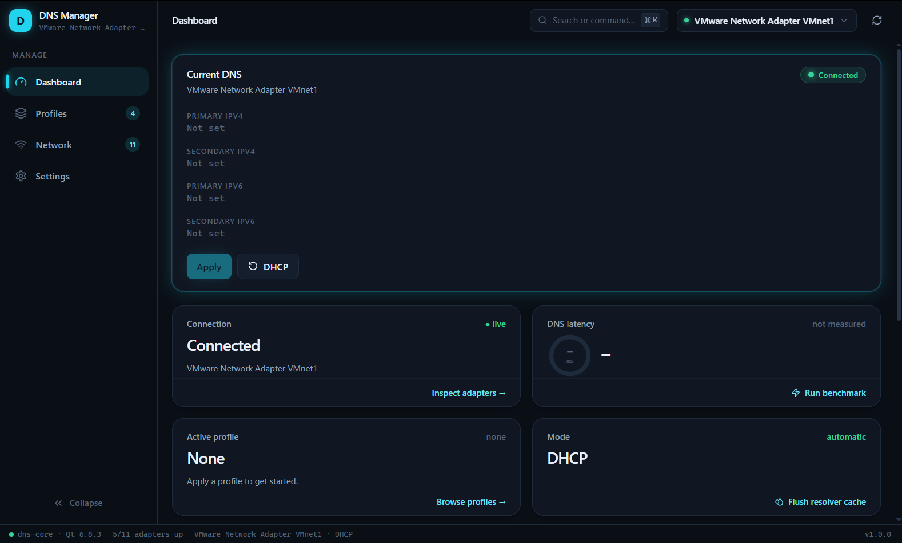

<p align="center">
  
</p>

#  ModernD DNS Manager

> Switch, benchmark and troubleshoot your Windows DNS configuration from a
> modern desktop UI — no registry hacking, no command line.

[](https://github.com/callmeD4N13L/DNS-Manager/actions/workflows/ci.yml)
[](https://github.com/callmeD4N13L/DNS-Manager/releases)
[](LICENSE)
[](#requirements)
[](CMakeLists.txt)
[](electron-app/)

A fast, lightweight **DNS manager for Windows 10/11** built with **C++20**
and **Electron + Chromium + React + TypeScript**. Inspect every adapter's DNS, switch between saved
profiles with one click, benchmark resolvers, flush the cache and reset back
to DHCP — with explicit, never-silent UAC elevation for the privileged bits.


---

## Features

**Adapters & insights**

- Enumerates Ethernet, Wi-Fi, virtual and VPN adapters with live status
- Reads current IPv4 / IPv6 DNS (static vs. DHCP) and resolver latency
- Detect connected / disconnected adapters at a glance

**DNS profiles**

- Save, edit, favorite and one-click apply named profiles
- Import / export profiles as portable JSON
- Seeded with popular resolvers (Cloudflare, Google, Quad9, AdGuard)

**Application**

- Dark / light / system theme, custom frameless title bar, smooth scrolling
- System tray integration — close to tray, apply profiles from the tray menu
- Launch with Windows, start minimized
- Rotating application log and crash minidumps
- Administrator elevation requested explicitly (UAC), never silently

## Quick start

Download the latest release from
[Releases](https://github.com/callmeD4N13L/DNS-Manager/releases):

| File | What it is |
| ---- | ---------- |
| `DNSManager-<version>-windows-x64-setup.exe` | **Recommended.** Inno Setup installer, 64-bit Windows |
| `DNSManager-<version>-windows-x86-setup.exe` | Inno Setup installer, 32-bit shell |
| `DNSManager-<version>-windows-x64-setup-electron.exe` | NSIS installer, 64-bit |
| `DNSManager-<version>-windows-x64-portable.exe` | No install — just run it |

No Qt UI, no Node, no admin rights needed for the UI — elevation (UAC) is
requested only for actual DNS changes.

Or build from source (see [docs/BUILD.md](docs/BUILD.md)):

```powershell
cmake --preset vs2022-release
cmake --build --preset vs2022-release --target dns-core
cd electron-app
npm install
npm run dev            # or: npm run build + npm run dist:portable
```

## Documentation

| Topic                 | Where                                        |
| --------------------- | -------------------------------------------- |
| Building & running    | [docs/BUILD.md](docs/BUILD.md)               |
| Packaging & deploying | [docs/DEPLOY.md](docs/DEPLOY.md)             |
| CI / GitHub Actions   | [.github/workflows](.github/workflows)       |

## Security & reliability

- DNS changes and DHCP resets are performed by an elevated helper launched
  through the standard Windows UAC prompt — never silently and never by
  `regedit`-style hacks.
- All system calls go through the documented Windows APIs
  (`Get/SetInterfaceDnsSettings`, `IP Helper`, Winsock, `dnsapi`).
- The test suite runs without admin rights and **never modifies the host's
  DNS** or registry, so it is safe in CI.
- Logs rotate automatically; crashes produce minidumps for diagnosis.

## Technology stack

| Layer     | Technology                                        |
| --------- | ------------------------------------------------- |
| Language  | C++20 (backend) + TypeScript (UI)                 |
| UI        | Electron, Chromium, React 19, TypeScript, Tailwind CSS 4, Framer Motion, lucide-react (`electron-app/`) |
| Backend   | C++20 services over Windows networking APIs (`IP Helper`, Winsock, `SetInterfaceDnsSettings`), Qt 6 Core/Network/Concurrent as utility library (no Qt UI) |
| Bridge    | `dns-core.exe` sidecar, NDJSON JSON-RPC over stdio |
| Storage   | Local JSON (`dns_profiles.json`)                  |
| Build     | CMake 3.25+, presets for MSVC / Ninja / MinGW; npm + electron-builder for the desktop shell |
| Packaging | electron-builder portable EXE / NSIS + Inno Setup (`installer/inno/`) |
| CI/CD     | GitHub Actions (build, test, release)             |

> **v2.0.0 note:** the former Qt/QML interface was replaced by the
> Electron/Chromium UI. Qt remains only as a backend C++ library
> (Core/Network/Concurrent). See [CHANGELOG.md](CHANGELOG.md) for the full
> migration notes.

## Architecture (`electron-app/`)

The entire user interface is rendered by **Electron → Chromium → React +
TypeScript** (`electron-app/`, see its [README](electron-app/README.md)).
The C++ backend ships as a headless `dns-core.exe` sidecar built from
`src/core`, `src/models`, `src/platform` and `src/cli`, speaking NDJSON
JSON-RPC over stdio. There is no Qt interface: no QML, no Widgets, no
Qt Quick — the `qml/` tree and QML bindings were removed.

```
renderer (React/TS) ──contextBridge──▶ Electron main ──stdio──▶ dns-core (C++)
```

## Project layout

```
├── src/cli           dns-core entry point (headless JSON-RPC sidecar)
├── src/core          Backend services (network, profiles, settings, ...)
├── src/models        Value models (adapters, profiles, DNS config)
├── src/platform      Windows system layer (IP Helper, Winsock, dnsapi)
├── electron-app/     Entire UI: Electron + React + TypeScript + Tailwind
├── installer/inno    Inno Setup installers (x64 + x86)
├── tests/            C++ unit tests (no admin privileges required)
├── resources/        App icons + dns-core VERSIONINFO (consumed by the builds)
├── scripts/          Icon generation helpers
└── docs/             Build and deployment guides
```

## Roadmap

- [x] C++ backend: adapter detection, DNS read/apply, DHCP reset, cache flush
- [x] DNS profiles, favorites, import / export
- [x] Latency benchmark, settings, logging, crash minidumps
- [x] Unit tests, GitHub Actions CI/CD
- [x] Electron + React UI replaces the former Qt/QML interface
- [x] Dynamic UI: animated stat cards, latency gauge, sidebar badges, command palette
- [x] Custom title bar, tray profiles menu, light theme, smooth scrolling

## Contributing

Contributions are welcome! Open an issue for bugs and feature requests, or a
pull request for improvements. Follow the existing code style
(`.clang-format`) and keep the test suite green (`ctest`).

## Support

DNS Manager is free and open source (MIT). If it saves you time, consider
supporting maintenance and new resolvers:

**Ethereum / EVM (MetaMask):**
```text
0x3f9A75Bd8bc2B4A703Ce071275D7B0ec2bED12E5
```

## License

[MIT](LICENSE) — DnsManager Contributors.
